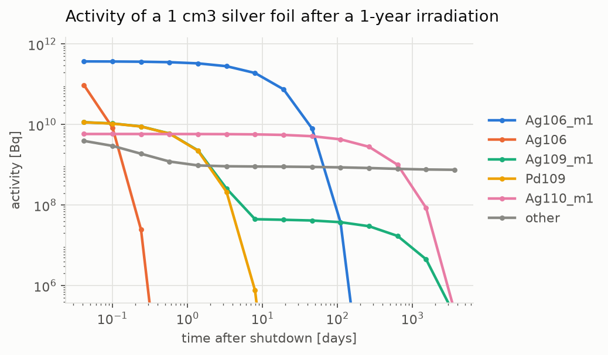
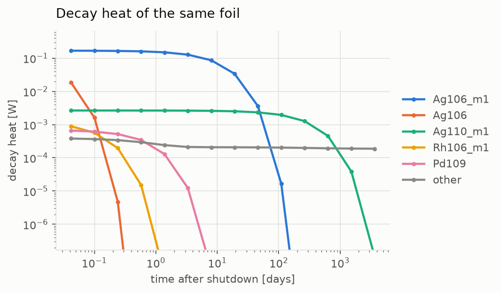
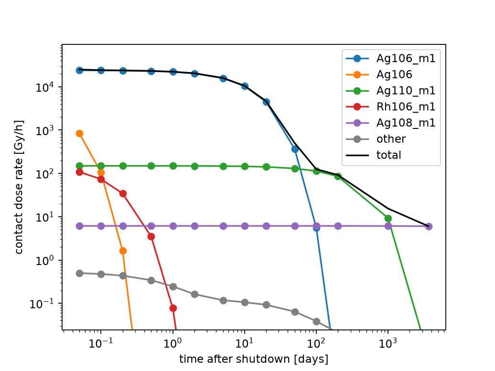
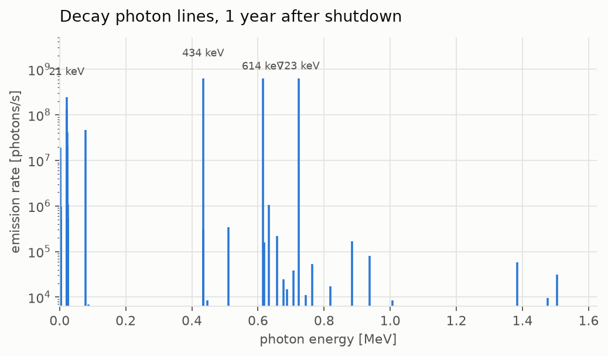

# Getting started

## Install

```bash
pip install yani
```

The wheel carries the compiled solver, so there is nothing to build and no
transport stack to pull in.

If you would rather not install yet,
[yani-online](https://fusion-neutronics.github.io/yani-online/) runs the same
solver in your browser and will write the setup you build there back out as a
Python script.

## Point it at nuclear data

Two kinds of data are needed, and they are configured separately.

**Cross sections**, for the `sigma * phi` reaction rates, come from a
continuous-energy library:

<!-- doctest: skip -->
```python
import yani

yani.cross_section_data = "tendl-2025"
```

**The transmutation network**, for the decay constants, reaction products,
fission yields and isomeric branching, is assembled from four independently
sourced subsections, so each is set on its own and a network can mix libraries:

<!-- doctest: skip -->
```python
yani.transmutation_reactions = "tendl-2025"
yani.transmutation_branch_ratios = "tendl-2025"
yani.transmutation_decay_data = "endf-b8.1"
yani.transmutation_fission_yields = "endf-b8.1"
```

The split above is not arbitrary. Each library publishes only some of what a
calculation needs:

| library | cross sections | `decay` | `reactions` | `fission_yields` | `branching` |
| --- | :---: | :---: | :---: | :---: | :---: |
| `tendl-2025` | yes | -- | yes | -- | yes |
| `tendl-2017` | yes | -- | yes | -- | yes |
| `endf-b8.1` | yes | yes | yes | yes | yes |
| `jeff-4.0` | yes | yes | yes | yes | yes |
| `fendl-3.2d` | yes | -- | -- | -- | -- |

TENDL is a neutron-only evaluation, so it has no decay or fission-yield
sublibrary and those two must come from `endf-b8.1` or `jeff-4.0`. It is still
what you want for `reactions`, because it covers far more parent nuclides, and
that is what decides whether an activation product appears in your inventory at
all. `jeff-4.0` is the one alternative that supplies a complete network from a
single library.

Pointing a subsection at a library that does not publish it fails immediately,
with a message listing what that library does have, rather than failing partway
through a download.

!!! warning
    Unconfigured data tends to read as a zero rather than an error. Forgetting
    `cross_section_data` leaves every `sigma * phi` at zero, so an irradiation
    produces nothing and the decay heat comes back `0.0` with no complaint. If a
    result is suspiciously empty or exactly zero, check these settings first.

A keyword is all this page needs. Paths, per-nuclide dicts and where the
download lands are in
[Where the data comes from](usage.md#where-the-data-comes-from).

## A first calculation

An irradiation schedule, a spectrum, and one call:

<!-- doctest: skip -->
```python
import yani

yani.cross_section_data = "tendl-2025"
yani.transmutation_reactions = "tendl-2025"
yani.transmutation_branch_ratios = "tendl-2025"
yani.transmutation_decay_data = "endf-b8.1"      # TENDL has no decay data
yani.transmutation_fission_yields = "endf-b8.1"  # nor fission yields

# A 1 cm3 silver foil. Giving the element rather than the nuclides expands it
# over natural abundance, here Ag107 (51.8%) and Ag109 (48.2%).
#
# A volume is required for anything extensive (activity, decay heat, photon
# lines): the solver works in atoms/barn-cm and the volume turns that into atoms.
foil = yani.Material({"Ag": 1.0}, density=10.49, volume=1.0)

# The spectrum rides on the pulse. The Histogram normalizes the shape, so a
# multigroup flux from a tally can be passed straight in; the pulse `rate` is the
# total flux magnitude in n/cm2/s.
spectrum = yani.NeutronSource(
    energy=yani.sources.Histogram([1e-5, 1e5, 1e6, 1.5e7], [1e12, 1e13, 1e14])
)
# Sample the decay at these times after shutdown, in days. A Cooldown takes the
# duration OF THAT STEP, so the schedule needs the gaps between them.
days = [0.05, 0.1, 0.2, 0.5, 1, 2, 5, 10, 20, 50, 100, 200, 1000, 3650]
gaps = [0.05, 0.05, 0.1, 0.3, 0.5, 1, 3, 5, 10, 30, 50, 100, 800, 2650]

schedule = yani.PulseSchedule(
    [yani.Pulse(rate=1.11e14, duration=(100, "d"), source=spectrum)]  # 100 days on
    + [yani.Cooldown(duration=(g, "d")) for g in gaps]                # then cooling
)

results = foil.transmute(schedule=schedule)    # TransmutationResults
steps = results.step_materials(material_id=foil.id or 0)   # one Material per step
final = steps[-1]

print(final.activity(), "Bq")
print(final.decay_heat(), "W")
print(final.contact_dose(), "Gy/h")
```

## What comes out

Ask for the results by nuclide and plot them and the shape of an activation
problem appears: which product dominates depends entirely on how long you wait.



`Ag106_m1` carries the activity for the first couple of months, then `Ag110_m1`
takes over for a few hundred days, so what dominates depends on when you look.
`Ag106` and `Pd109` are gone within days. Past a few years `Ag110_m1` has
decayed too and `Ag108_m1` is what is left: it never peaks high enough to make
the five largest, so the grey "other" line is the one still carrying the
activity at the right-hand edge. Every point is a real solve, not a sketch.

<details>
<summary>Plotting code</summary>

```python
import matplotlib.pyplot as plt

cooled = steps[1:]                         # drop the irradiation step
per_step = [m.activity(by_nuclide=True) for m in cooled]

# The five largest by peak value, everything else summed into "other".
keys = {k for d in per_step for k in d}
peak = {k: max(d.get(k, 0.0) for d in per_step) for k in keys}
top = [k for k, _ in sorted(peak.items(), key=lambda kv: -kv[1])[:5]]

fig, ax = plt.subplots()
for name in top:
    ax.plot(days, [d.get(name, 0.0) for d in per_step], marker="o", label=name)
ax.plot(days, [sum(v for k, v in d.items() if k not in top) for d in per_step],
        marker="o", color="grey", label="other")

ax.set_xscale("log"); ax.set_yscale("log")
# Six decades. Below that a decayed-away nuclide is numerical dust, and
# letting it set the scale squashes everything that matters.
ax.set_ylim(max(peak.values()) / 1e6, max(peak.values()) * 4)
ax.set_xlabel("time after shutdown [days]"); ax.set_ylabel("activity [Bq]")
ax.legend()
```

</details>

Decay heat is the same call with a different observable, and tells a different
story: `Ag110_m1` climbs from fifth place to third and `Ag109_m1` leaves the
five altogether, replaced by `Rh106_m1`. What heats the material is energy per
decay, not decays per second, and an isomeric transition is a cheap decay.



<details>
<summary>Plotting code</summary>

```python
import matplotlib.pyplot as plt

cooled = steps[1:]                         # drop the irradiation step
per_step = [m.decay_heat(by_nuclide=True) for m in cooled]

# The five largest by peak value, everything else summed into "other".
keys = {k for d in per_step for k in d}
peak = {k: max(d.get(k, 0.0) for d in per_step) for k in keys}
top = [k for k, _ in sorted(peak.items(), key=lambda kv: -kv[1])[:5]]

fig, ax = plt.subplots()
for name in top:
    ax.plot(days, [d.get(name, 0.0) for d in per_step], marker="o", label=name)
ax.plot(days, [sum(v for k, v in d.items() if k not in top) for d in per_step],
        marker="o", color="grey", label="other")

ax.set_xscale("log"); ax.set_yscale("log")
# Six decades. Below that a decayed-away nuclide is numerical dust, and
# letting it set the scale squashes everything that matters.
ax.set_ylim(max(peak.values()) / 1e6, max(peak.values()) * 4)
ax.set_xlabel("time after shutdown [days]"); ax.set_ylabel("decay heat [W]")
ax.legend()
```

</details>

Contact dose rate is a third reading of the same inventory, and the only one of
the three that needs no `volume`: it is a slab estimate, so the geometry cancels
and a bigger piece of the same foil reads the same with a hand on it. Its
breakdown is always a subset of the activity's, because only the gamma emitters
reach it -- a nuclide that carries the activity without emitting photons drops
out of this plot entirely, which is what makes the two curves worth reading side
by side.



Here that costs `Ag109_m1` and `Pd109` their places: third and fourth in the
activity, neither makes the five largest by dose, and `Rh106_m1` and `Ag108_m1`
take their seats. Fourteen of the eighty-nine nuclides carrying activity emit no
photons at all and are simply absent -- `H3`, `Ru106` and `Zr93` among them.

The dose itself is `Ag106_m1`'s out to twenty days, better than 99% of it, and
`Ag110_m1`'s by a hundred. What the log axis then shows, and the other two plots
have no equivalent of, is the flat line the total settles onto: `Ag108_m1` has a
438 year half-life, so across the whole ten years it neither grows nor decays,
and at the right-hand edge it is the entire dose. Three and a half decades below
the peak and last in the five for most of the plot, it is nonetheless what
decides whether the foil can be handled once the rest has gone.

<details>
<summary>Plotting code</summary>

```python
import matplotlib.pyplot as plt

cooled = steps[1:]                         # drop the irradiation step
per_step = [m.contact_dose(by_nuclide=True) for m in cooled]

# The five largest by peak value, everything else summed into "other".
keys = {k for d in per_step for k in d}
peak = {k: max(d.get(k, 0.0) for d in per_step) for k in keys}
top = [k for k, _ in sorted(peak.items(), key=lambda kv: -kv[1])[:5]]

fig, ax = plt.subplots()
for name in top:
    ax.plot(days, [d.get(name, 0.0) for d in per_step], marker="o", label=name)
ax.plot(days, [sum(v for k, v in d.items() if k not in top) for d in per_step],
        marker="o", color="grey", label="other")

# The total is a line of its own here, since "can this be handled" is a question
# about the sum rather than about which nuclide is responsible for it.
ax.plot(days, [m.contact_dose() for m in cooled], color="black", label="total")

ax.set_xscale("log"); ax.set_yscale("log")
ax.set_ylim(max(peak.values()) / 1e6, max(peak.values()) * 4)
ax.set_xlabel("time after shutdown [days]")
ax.set_ylabel("contact dose rate [Gy/h]")
ax.legend()
```

</details>

The decay photon spectrum is a set of discrete lines rather than a curve, so it
wants stems. `steps[-1]` is ten years after shutdown, where the strongest
lines are at 723, 434 and 614 keV, which are `Ag108_m1`'s gammas: this is the
spectrum a detector outside the foil would see, and it identifies the nuclide.



<details>
<summary>Plotting code</summary>

```python
import matplotlib.pyplot as plt

energies, intensities = steps[-1].decay_photon_spectrum()

# Several hundred lines come back, most of them numerically negligible. Keep
# the ones within five decades of the strongest; the rest are not physics.
pairs = sorted(zip(energies, intensities), key=lambda p: -p[1])
floor = pairs[0][1] / 1e5
keep = [(e / 1e6, i) for e, i in pairs if i >= floor]

fig, ax = plt.subplots()
ax.vlines([e for e, _ in keep], floor, [i for _, i in keep])
ax.set_yscale("log"); ax.set_ylim(floor, pairs[0][1] * 8)
ax.set_xlabel("photon energy [MeV]")
ax.set_ylabel("emission rate [photons/s]")

for e, i in keep[:4]:
    ax.annotate(f"{e * 1000:.0f} keV", xy=(e, i), xytext=(0, 8),
                textcoords="offset points", ha="center")
```

</details>

`days` above is the cumulative cooling time of each step, which is what the
plots use for their x axis.

`transmute()` returns a `TransmutationResults`, keyed by material id.
`step_materials()` unpacks it into one `Material` per timestep, in order, each
carrying the inventory at the end of that step. `get_final_material()` hands back
the last of them directly, returning `None` rather than raising if the id is not
one it stepped. They are ordinary materials, so anything you can ask a material
you can ask a result:

<!-- doctest: skip -->
```python
print(final.activity(by_nuclide=True))     # {"Ag110m": ..., "Ag108m": ..., ...}
print(final.decay_heat(by_nuclide=True))   # W per nuclide
print(final.contact_dose(by_nuclide=True)) # Gy/h per nuclide
print(len(final.nuclides))                 # how much the network grew

energies, intensities = final.decay_photon_spectrum()   # photons/s per line
```

## Next steps

- [Usage](usage.md) for schedules, spectra, results and converting your own data.
- [API reference](api.md) for the full typed surface.
